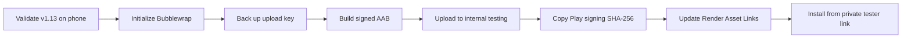

# Kikroo v1.13 - Google Play internal test

This phase turns the public Kikroo PWA into a signed Android App Bundle (`.aab`) for a private Google Play internal test. It does not publish Kikroo publicly.

## Fixed release identity

| Setting | Value |
| --- | --- |
| Store and launcher name | Kikroo |
| Android application ID | `com.badie.kikroo` |
| Version name | `1.13.0` |
| Version code | `11300` |
| Hosted application | `https://atlastime-staging.onrender.com` |
| Web manifest | `https://atlastime-staging.onrender.com/manifest.webmanifest` |
| Digital Asset Links | `https://atlastime-staging.onrender.com/.well-known/assetlinks.json` |

Do not change `com.badie.kikroo` after creating the Play Console application. A different application ID is treated as a different app.

## Security boundaries

- Do not paste a signing password, keystore, Google service-account file, OAuth secret, or certificate private key into chat, GitHub, screenshots, or documentation.
- Create the upload keystore outside the Git repository and keep a separate encrypted backup.
- The generated Android project, `.aab`, `.apk`, and signing material are excluded from Git.
- The committed scripts use Bubblewrap `1.24.1` so repeated packaging uses the same tool version.

## Stage 1 - accept the v1.13 phone layout

Open the deployed v1.13 URL on an Android phone and confirm:

1. The page does not move slightly up or down when the first workspace is idle.
2. The Kikroo logo is larger without increasing the top header.
3. Six overview slots are visible on the first workspace.
4. A seventh or later person scrolls inside the tile grid; the complete page does not move.
5. The bottom time slider remains reachable and the **Now** button responds.
6. Left/right workspace navigation, Google Calendar, and Outlook Calendar still work.

## Stage 2 - initialize the Android project on Windows

Open **Show in Explorer** for the Kikroo repository, click the Explorer address bar, type `cmd`, and press Enter. Then run:

```cmd
npm.cmd install
npm.cmd run android:check
npm.cmd run android:init
```

The last command opens Bubblewrap's guided setup. On its first run, allow it to obtain its Android/JDK prerequisites. Use these answers whenever prompted:

- Application ID: `com.badie.kikroo`
- App name: `Kikroo`
- Launcher name: `Kikroo`
- Version name: `1.13.0`
- Version code: `11300`
- Display mode: `standalone`
- Orientation: `any`
- Signing alias: `kikroo-upload`
- Signing-key location: a private folder outside the Git repository, for example `C:\Users\YOUR_NAME\Documents\Kikroo-private\kikroo-upload.jks`

Choose a new strong password when Bubblewrap requests one. Store the password in a password manager and back up the `.jks` file. Losing this upload key creates a recovery process and can block normal updates.

The command normalizes the generated project back to the fixed values in `android/release-config.json`, preventing an accidental package or version mismatch.

## Stage 3 - generate the signed App Bundle

From the same CMD window run:

```cmd
npm.cmd run android:build:bundle
```

Enter the keystore password only in the local prompt. When successful, the final line shows a file similar to:

```text
android\output\kikroo-1.13.0-11300.aab
```

This `.aab` is the file to upload to Google Play Console. It is intentionally not tracked by Git.

## Stage 4 - create the private Google Play test

1. Open [Google Play Console](https://play.google.com/console/).
2. Create the app with public name **Kikroo**, default language, and the appropriate app/game and free/paid selections.
3. Complete every required dashboard declaration. Use the existing privacy and calendar-data model; do not claim that Kikroo reads event titles because it only uses busy/free data.
4. In the left menu open **Testing > Internal testing**.
5. Choose **Create new release** and enable Play App Signing when offered.
6. Upload `kikroo-1.13.0-11300.aab`.
7. Add release notes such as `First private Kikroo Android internal test.`
8. Save, review, and start the rollout to internal testing.
9. Add tester email addresses and open the opt-in link on the Android phone using one of those accounts.

## Stage 5 - remove the browser bar with Play's certificate

After the bundle is accepted, open **Setup > App integrity** in Play Console and copy the **SHA-256 certificate fingerprint** under **App signing key certificate**. Do not use the SHA-1 value.

In Render, open `atlastime-staging > Environment` and set:

- `ANDROID_APP_PACKAGE_ID` = `com.badie.kikroo`
- `ANDROID_SHA256_CERT_FINGERPRINTS` = the Play app-signing SHA-256 fingerprint

If a locally signed test must also open without a browser bar, place both SHA-256 fingerprints in the second variable separated by a comma. Save and redeploy Render, then verify that the Digital Asset Links URL returns a JSON list.

## Internal-test acceptance gate

- Kikroo installs from the private Play tester link.
- It opens without a browser address bar after Digital Asset Links is active.
- Google and Microsoft OAuth return to Kikroo.
- Busy/free planning matches the public PWA.
- Install, update, back navigation, offline reopen, disconnect, and revoke work.
- No secret, signing file, calendar token, or private calendar record exists in Git or the bundle.


