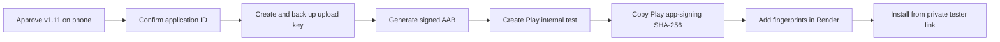

# Kikroo v1.12 — first private Android installation

This phase packages the existing public Kikroo PWA as a Trusted Web Activity (TWA). The first result is a private Google Play internal test, not a public store launch.

## Prepared values

| Setting | Prepared value | Status |
| --- | --- | --- |
| App name | Kikroo | Ready |
| Confirmed application ID | `com.badie.kikroo` | Ready; do not change after Play app creation |
| Initial HTTPS host | `atlastime-staging.onrender.com` | Ready for private testing |
| Version name | `1.12.0` | Ready |
| Version code | `11200` | Ready |
| Web manifest | `https://atlastime-staging.onrender.com/manifest.webmanifest` | Ready after v1.12 deploy |
| Digital Asset Links | `https://atlastime-staging.onrender.com/.well-known/assetlinks.json` | Activates after certificate fingerprints are added in Render |

The application ID becomes effectively permanent when the Play Console application is created. `com.badie.kikroo` was selected to keep the public technical identifier separate from the owner's full personal name.

## What is already automated

- The web manifest includes 192×192, 512×512, and maskable PNG icons.
- `npm run android:check` validates package identity, HTTPS, versions, and icon dimensions.
- Render can publish `assetlinks.json` from environment settings.
- More than one SHA-256 fingerprint can be published, allowing local/upload signing and Google Play App Signing to coexist.
- Signing keys, passwords, bundles, and fingerprints are excluded from the repository.

## Safe release sequence

## Step 1 — physical phone acceptance

Open `https://atlastime-staging.onrender.com` on the Android phone after Render deploys v1.12. Confirm:

1. The header shows v1.12.
2. The five mobile workspaces swipe and wrap around correctly.
3. Closing and reopening returns to Everyone's Time.
4. Cards remain aligned with normal and enlarged text.
5. The persistent slider remains readable and Now responds.
6. Google and Outlook still connect and disconnect.

## Step 2 — confirm the permanent identity

The following values are confirmed for package generation:

- Application ID: `com.badie.kikroo`
- Store name: `Kikroo`

Changing the application ID after Play publication creates a different app rather than an update.

## Step 3 — generate outside GitHub

The next assisted session will install the Android packaging prerequisites, initialize Bubblewrap from the public manifest, create the upload key outside this repository, and generate the signed `.aab`. The key password must not be pasted into screenshots, GitHub, source files, or chat.

The current Windows computer does not yet have Java installed. Bubblewrap can provision the required Android tools during initialization, but this download should happen only after Steps 1 and 2 pass.

## Step 4 — connect Google Play App Signing

After the first bundle is uploaded, Play Console provides the **App signing key certificate SHA-256 fingerprint**. Add it in Render:

1. Open the `atlastime-staging` service.
2. Select **Environment** in the left column.
3. Set `ANDROID_APP_PACKAGE_ID` to `com.badie.kikroo`.
4. Set `ANDROID_SHA256_CERT_FINGERPRINTS` to the Play app-signing SHA-256 fingerprint. If also testing a locally signed build, separate both fingerprints with a comma.
5. Save and redeploy.
6. Open `https://atlastime-staging.onrender.com/.well-known/assetlinks.json`; it must return a JSON list, not an error page.

## Internal-test acceptance gate

- Kikroo opens without a browser address bar.
- OAuth returns to the installed app for Google and Microsoft.
- Calendar busy/free information behaves exactly like the tested PWA.
- Installation, update, offline reopen, back navigation, disconnect, and revoke all work.
- No signing key, password, token, or personal calendar record exists inside the bundle or GitHub repository.
