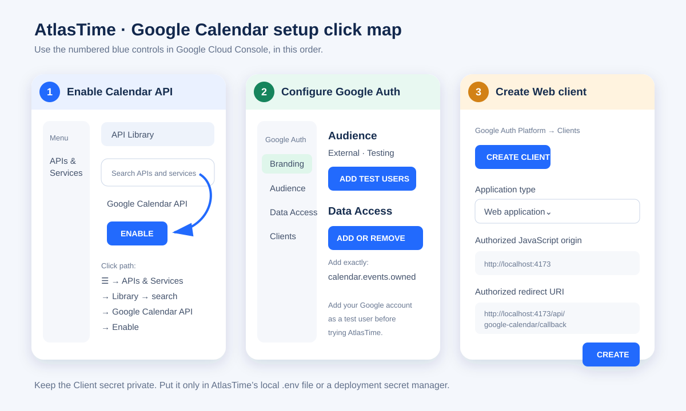

# Google Calendar connection boundary

AtlasTime's local PWA intentionally contains no OAuth client secret and stores no refresh token. Google currently recommends the OAuth 2.0 authorization-code model for the stronger, persistent connection AtlasTime wants. In that model, the browser receives an authorization code and sends it to a backend endpoint that validates the request, exchanges the code, and protects the resulting refresh token.

## What is ready in the PWA

- Local contacts can have optional email addresses.
- The organizer can include or exclude each valid email before calendar handoff.
- Google, Outlook, and `.ics` actions show a final structured review.
- Provider drafts and `.ics` exports remain usable without a connected account.

## Gateway now included

`server/googleCalendarGateway.mjs` implements the provider boundary without third-party runtime dependencies:

- state and PKCE-bound authorization-code initiation;
- server-side code exchange;
- AES-256-GCM encrypted refresh-token storage in an HttpOnly, SameSite cookie;
- narrow `calendar.events.owned` authorization;
- same-origin and explicit-header checks for mutations;
- primary-calendar event insertion with selected attendee updates;
- provider revocation and local cookie removal.

`server/index.mjs` serves the built PWA and gateway from one origin. When configuration is absent, calendar endpoints return a clear `503` response and the local PWA remains usable.

## Deployment still requires

1. A production HTTPS origin for AtlasTime.
2. A Google Cloud project with Calendar API enabled and an OAuth consent screen.
3. A Web OAuth client whose JavaScript origin and redirect endpoint exactly match production.
4. The four server-only Google variables documented in `.env.example`, plus `ATLASTIME_APP_ORIGIN`.
5. A unique 32-byte base64url encryption key stored in the deployment secret manager.
6. Provider testing with a primary calendar and the narrow event permission before Microsoft authorization begins.

## Click-by-click local test setup

> Do not paste the Google client secret or the AtlasTime encryption key into an issue, pull request, screenshot, or chat. They belong only in your local `.env` file or a deployment secret manager.



### 1. Create or select the Google Cloud project

1. Open [Google Cloud Console](https://console.cloud.google.com/).
2. Click the project selector in the top bar.
3. Choose an existing AtlasTime project or click **New project**, name it `AtlasTime`, and click **Create**.
4. Confirm the AtlasTime project is selected before continuing.

### 2. Enable Google Calendar API

1. Click **☰ Menu**.
2. Click **APIs & Services** → **Library**.
3. Search for `Google Calendar API`.
4. Open **Google Calendar API** and click **Enable**.

### 3. Configure the consent screen for testing

1. Open **☰ Menu** → **Google Auth Platform**.
2. If Google shows **Get started**, click it.
3. Under **Branding**, use `AtlasTime` as the app name and choose your support email.
4. Under **Audience**, choose **External** and keep the app in **Testing**.
5. Under **Test users**, click **Add users** and add the Google account that will test AtlasTime.
6. Under **Data Access**, click **Add or remove scopes** and add only:

   `https://www.googleapis.com/auth/calendar.events.owned`

This scope lets AtlasTime create and manage events it owns. It does not read the rest of the calendar and does not provide free/busy access.

### 4. Create the Web OAuth client

1. Open **Google Auth Platform** → **Clients**.
2. Click **Create client**.
3. Choose **Web application**.
4. Name it `AtlasTime local test`.
5. Under **Authorized JavaScript origins**, add:

   `http://localhost:4173`

6. Under **Authorized redirect URIs**, add:

   `http://localhost:4173/api/google-calendar/callback`

7. Click **Create**.
8. Copy the Client ID and Client secret to a private temporary note. Never commit either value.

### 5. Configure AtlasTime locally

In Windows CMD, from the AtlasTime project folder:

```bat
copy .env.example .env
node -e "console.log(require('node:crypto').randomBytes(32).toString('base64url'))"
notepad .env
```

In Notepad, keep the two local URLs and fill in the three private values:

```dotenv
ATLASTIME_APP_ORIGIN=http://localhost:4173
GOOGLE_OAUTH_CLIENT_ID=PASTE_YOUR_CLIENT_ID
GOOGLE_OAUTH_CLIENT_SECRET=PASTE_YOUR_CLIENT_SECRET
GOOGLE_OAUTH_REDIRECT_URI=http://localhost:4173/api/google-calendar/callback
GOOGLE_TOKEN_ENCRYPTION_KEY=PASTE_THE_GENERATED_KEY
```

Save and close Notepad. The `.env` file is ignored by Git.

### 6. Run and test the connected flow

```bat
npm.cmd run preview:connected
```

1. Open `http://localhost:4173`.
2. Plan a meeting and scroll to **Handoff**.
3. Under **Google Calendar**, click **Connect Google Calendar**.
4. Choose the Google account you added as a test user and approve the single Calendar permission.
5. Return to AtlasTime and confirm the panel says **Connected**.
6. Select the intended invitees.
7. Click **Create Google event**, review the final dialog, then click **Create Google event** again.
8. Click **Open created event** and verify the title, start, finish, notes, location, and invitees.
9. Return to AtlasTime and click **Disconnect** to verify revocation and local cleanup.

While the OAuth app remains in Google's Testing mode, authorizations that include Calendar access expire after seven days. This is expected during development.

Generate a development encryption key without writing it into source control:

```bash
node -e "console.log(require('node:crypto').randomBytes(32).toString('base64url'))"
```

The production reverse proxy or hosting platform must terminate HTTPS and pass the original same-origin `Origin`, cookies, method, and request body to the Node process.

## Endpoint contract

- `GET /api/google-calendar/connect` starts explicit authorization.
- `GET /api/google-calendar/callback` validates and completes the server-side exchange.
- `GET /api/google-calendar/status` returns only connection state and granted scope.
- `POST /api/google-calendar/events` creates the final confirmed event.
- `POST /api/google-calendar/disconnect` revokes provider access and clears local token state.

Mutation requests must be same-origin and include `X-AtlasTime-CSRF: 1`. Tokens and client secrets are never returned to the PWA.

No free/busy permission belongs in this phase. Availability access remains a separate v1.2 consent decision.

## Primary references

- Google Identity Services code model: https://developers.google.com/identity/oauth2/web/guides/use-code-model
- Google authorization model comparison: https://developers.google.com/identity/oauth2/web/guides/choose-authorization-model
- Google Calendar authorization scopes: https://developers.google.com/workspace/calendar/api/auth
- Google Calendar event insertion: https://developers.google.com/workspace/calendar/api/v3/reference/events/insert
