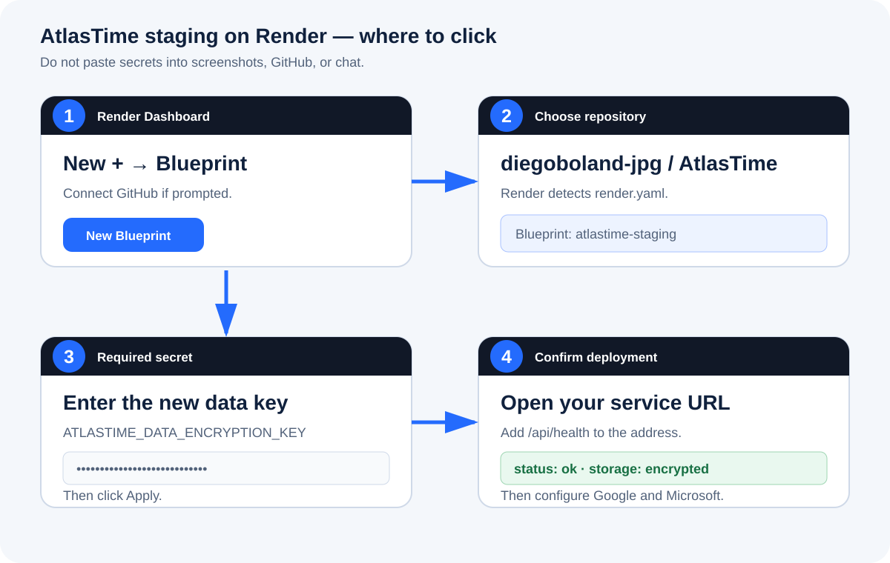
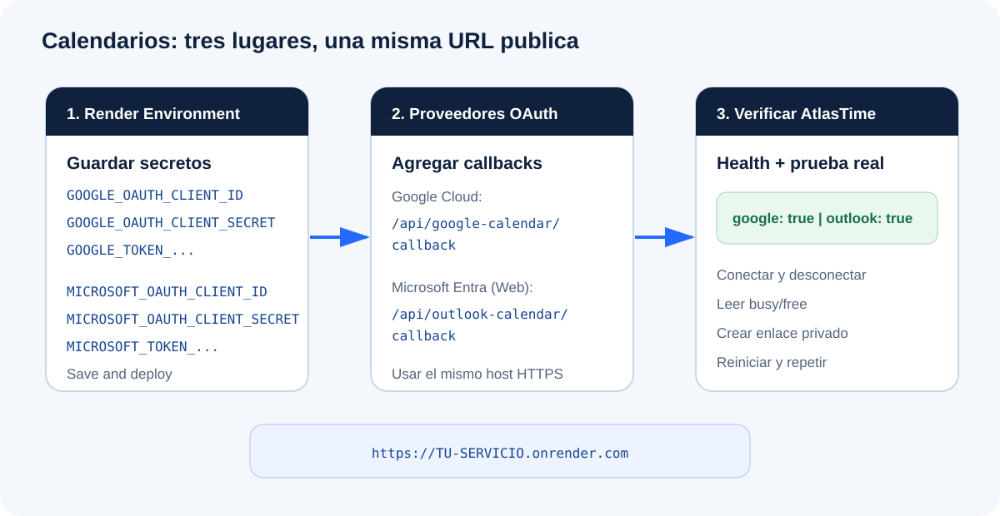

# Publicar AtlasTime v1.10 en Render (guia ilustrada)

Esta guia crea el primer entorno publico de pruebas de AtlasTime con HTTPS, almacenamiento persistente cifrado y conexiones opcionales a Google Calendar y Outlook. No publica la aplicacion en Google Play ni en App Store, y no necesita un dominio propio.



## Resultado esperado

Al terminar tendras:

- una direccion publica parecida a `https://atlastime-staging.onrender.com`;
- el mismo sitio funcionando en PC y telefono sin depender de tu red Wi-Fi;
- datos cifrados conservados despues de reinicios y nuevas versiones;
- Google Calendar y Outlook conectables desde la direccion publica;
- enlaces privados de disponibilidad que siguen funcionando despues de reiniciar el servidor.

## Antes de empezar

Necesitas:

- una cuenta en [Render](https://dashboard.render.com/);
- acceso en GitHub al repositorio `diegoboland-jpg/AtlasTime`;
- acceso a los clientes OAuth que ya configuraste en Google Cloud y Microsoft Entra;
- una tarjeta o metodo de pago en Render.

Importante sobre el costo: AtlasTime necesita un servicio web de pago para usar un disco persistente. Render factura el servicio y el almacenamiento segun el uso. La pantalla final de Render muestra la estimacion vigente antes de confirmar. No pulses **Apply** hasta revisar y aceptar ese importe.

No copies secretos en GitHub, capturas de pantalla, mensajes o documentos. Render debe ser el unico lugar, ademas de tu gestor de contrasenas, donde los pegues.

## Preparacion: genera tres claves diferentes

AtlasTime utiliza una clave para sus datos y una clave independiente para cada proveedor de calendario. Abre **CMD** dentro de la carpeta AtlasTime y ejecuta este comando tres veces:

```text
node -e "console.log(require('node:crypto').randomBytes(32).toString('base64url'))"
```

Guarda cada resultado temporalmente en un gestor de contrasenas y etiquetalos asi:

| Nombre en Render | Uso |
| --- | --- |
| `ATLASTIME_DATA_ENCRYPTION_KEY` | Cifra solicitudes y enlaces de disponibilidad |
| `GOOGLE_TOKEN_ENCRYPTION_KEY` | Cifra la autorizacion de Google |
| `MICROSOFT_TOKEN_ENCRYPTION_KEY` | Cifra la autorizacion de Microsoft |

Cada valor debe ser diferente. Si pierdes una clave, los datos cifrados con ella no se pueden recuperar.

## Paso 1: crear la cuenta y conectar GitHub

1. Abre [dashboard.render.com](https://dashboard.render.com/).
2. Inicia sesion. Si Render ofrece **Sign in with GitHub**, es la opcion mas sencilla.
3. Si aparece **Authorize Render**, permite acceso a GitHub.
4. Cuando GitHub pregunte por repositorios, elige **Only select repositories**.
5. Marca `diegoboland-jpg/AtlasTime` y confirma con **Install** o **Save**.
6. Regresa al panel de Render.

Si AtlasTime no aparece mas adelante, abre GitHub, ve a **Settings > Applications > Installed GitHub Apps > Render > Configure** y comprueba que AtlasTime este seleccionado.

## Paso 2: crear el Blueprint

1. En el panel de Render, pulsa **New +**.
2. Selecciona **Blueprint**.
3. Busca y selecciona `diegoboland-jpg/AtlasTime`.
4. En **Branch**, confirma `main`.
5. En **Blueprint Path**, deja `render.yaml`.
6. Pulsa **Connect**.

Render leera el archivo `render.yaml` y mostrara estos elementos:

- servicio: `atlastime-staging`;
- tipo: Web Service con Docker;
- plan: Starter;
- disco: `atlastime-data`;
- tamano: 1 GB;
- punto de montaje: `/data`;
- comprobacion de salud: `/api/health`.

## Paso 3: introducir la primera clave y revisar el cobro

1. Busca el campo `ATLASTIME_DATA_ENCRYPTION_KEY`.
2. Pega la primera clave generada. No reutilices una clave local anterior.
3. Comprueba que el servicio sea `atlastime-staging` y la rama sea `main`.
4. Revisa la estimacion mensual que Render muestra para el servicio y el disco.
5. Si aceptas el importe, pulsa **Apply**.

Este es el primer punto que puede iniciar cargos. Antes de **Apply** todavia puedes cancelar sin crear el servicio.

## Paso 4: esperar el primer despliegue

1. Render abre el servicio y comienza a construirlo.
2. Abre la pestana **Events** o **Logs** si quieres ver el progreso.
3. Espera los estados **Build successful**, **Deploying** y finalmente **Live**.
4. No cierres ni reinicies el servicio mientras se esta construyendo.

Si falla, copia solo las ultimas lineas del registro que contienen `error`. Oculta cualquier secreto antes de compartir una captura.

## Paso 5: comprobar la direccion publica

1. En la parte superior del servicio, pulsa la direccion `https://...onrender.com`.
2. Confirma que AtlasTime abre y muestra `v1.10`.
3. Anade `/api/health` al final de la direccion. Ejemplo:

```text
https://atlastime-staging.onrender.com/api/health
```

Debes ver un resultado con estas propiedades:

```json
{
  "status": "ok",
  "version": "1.10.0",
  "storage": "encrypted",
  "calendars": {
    "google": false,
    "outlook": false
  }
}
```

Los calendarios aparecen inicialmente como `false`; eso es correcto hasta completar los pasos siguientes.

## Paso 6: configurar Google Calendar



### En Render

1. Abre `atlastime-staging`.
2. En el menu izquierdo pulsa **Environment**.
3. Pulsa **Add Environment Variable** tres veces.
4. Introduce estos nombres y sus valores:

```text
GOOGLE_OAUTH_CLIENT_ID
GOOGLE_OAUTH_CLIENT_SECRET
GOOGLE_TOKEN_ENCRYPTION_KEY
```

Usa el Client ID y Client Secret del cliente web AtlasTime que ya existe en Google Cloud. Para la tercera variable usa la segunda clave generada al principio.

### En Google Cloud

1. Abre [Google Cloud Console](https://console.cloud.google.com/).
2. Selecciona el proyecto que contiene AtlasTime.
3. Ve a **Google Auth Platform > Clients**.
4. Abre el cliente web de AtlasTime.
5. En **Authorized JavaScript origins**, anade la direccion Render sin barra final:

```text
https://TU-SERVICIO.onrender.com
```

6. En **Authorized redirect URIs**, anade:

```text
https://TU-SERVICIO.onrender.com/api/google-calendar/callback
```

7. Pulsa **Save**.

No necesitas definir `GOOGLE_OAUTH_REDIRECT_URI` en Render: AtlasTime lo calcula automaticamente usando la direccion publica.

## Paso 7: configurar Outlook

### En Render

En la misma pagina **Environment**, agrega:

```text
MICROSOFT_OAUTH_CLIENT_ID
MICROSOFT_OAUTH_CLIENT_SECRET
MICROSOFT_TOKEN_ENCRYPTION_KEY
```

Usa el Application (client) ID y el secreto de AtlasTime creados en Microsoft Entra. Para la tercera variable usa la tercera clave generada al principio.

### En Microsoft Entra

1. Abre [Microsoft Entra admin center](https://entra.microsoft.com/).
2. Ve a **App registrations** y abre `AtlasTime local test` o el nombre que elegiste.
3. Entra en **Authentication**.
4. En la plataforma **Web**, pulsa **Add URI**.
5. Introduce:

```text
https://TU-SERVICIO.onrender.com/api/outlook-calendar/callback
```

6. Pulsa **Save**.

No necesitas definir `MICROSOFT_OAUTH_REDIRECT_URI` en Render.

## Paso 8: guardar variables y redesplegar

1. Regresa a Render > **Environment**.
2. Pulsa **Save, rebuild, and deploy** si aparece esa opcion; **Save and deploy** tambien sirve.
3. Espera nuevamente hasta que el servicio muestre **Live**.
4. Abre `/api/health`.
5. Comprueba que `google` y `outlook` ahora sean `true`.

Si uno permanece en `false`, revisa que esten presentes las tres variables de ese proveedor. No necesitas revelar sus valores.

## Paso 9: prueba funcional completa

Realiza las pruebas en este orden:

1. Abre AtlasTime en una ventana privada del PC.
2. Conecta Google Calendar y autoriza el acceso.
3. Confirma que AtlasTime muestra disponibilidad ocupada/libre.
4. Desconecta Google y confirma que el boton vuelve a **Connect**.
5. Conecta Outlook, confirma la disponibilidad y desconecta.
6. Crea una solicitud privada de disponibilidad para una persona.
7. Abre el enlace desde el telefono usando datos moviles, no el Wi-Fi de casa.
8. Comparte disponibilidad desde Google u Outlook.
9. Regresa al organizador y confirma que el estado se actualiza.
10. Crea un evento de prueba y confirma que titulo, fecha, hora e invitados llegan al calendario.

## Paso 10: comprobar que los datos sobreviven un reinicio

1. Crea un enlace privado de prueba y guardalo.
2. En Render abre el servicio.
3. Pulsa **Manual Deploy > Restart service**. Si la interfaz cambia, busca **Restart service** en el menu de acciones del servicio.
4. Espera hasta **Live**.
5. Abre de nuevo el mismo enlace.

La prueba es correcta si el enlace sigue existiendo. Esto confirma que `/data` esta montado en el disco persistente.

## Paso 11: auditoria y copia de seguridad

1. En Render abre la pestana **Shell** del servicio.
2. Ejecuta:

```text
npm run production:check
```

Debe finalizar con `READY`.

3. Luego ejecuta:

```text
npm run backup:data
```

4. Guarda fuera de Render el archivo cifrado indicado y su archivo `.sha256`.

Render crea instantaneas diarias del disco, pero la copia cifrada independiente protege frente a errores de cuenta o eliminacion accidental del servicio.

## Problemas frecuentes

### AtlasTime no aparece al crear el Blueprint

Revisa el acceso de la aplicacion Render en GitHub y selecciona el repositorio AtlasTime.

### La pagina muestra `Deploy failed`

Abre **Logs**, ve al final y busca la primera linea de error. Los avisos anteriores normalmente no son la causa.

### `/api/health` no abre

Confirma que el servicio este **Live** y que la direccion termine exactamente en `/api/health`.

### `storage` dice `development-plaintext`

No continues con pruebas reales. Revisa `NODE_ENV=production` y `ATLASTIME_DATA_ENCRYPTION_KEY`, guarda y vuelve a desplegar.

### Google muestra `redirect_uri_mismatch`

La URI de Google debe coincidir caracter por caracter con:

```text
https://TU-SERVICIO.onrender.com/api/google-calendar/callback
```

No uses `localhost`, no agregues una barra final y confirma que editaste el cliente OAuth correcto.

### Microsoft muestra un error de redireccion

Confirma que la URI fue agregada a la plataforma **Web**, no a SPA, y que coincide exactamente con la direccion Render.

### El enlace funciona en PC pero no en telefono

Usa la direccion `https://...onrender.com`, no `localhost` ni `192.168.x.x`. Prueba con datos moviles para confirmar acceso publico real.

### Los datos desaparecen al reiniciar

En Render abre **Disks** y confirma un disco de 1 GB montado exactamente en `/data`. Si no existe, detente: el servicio no tiene persistencia segura.

## Limites conocidos de este entorno

- El disco persistente solo puede conectarse a una instancia del servicio.
- Los despliegues con disco tienen una interrupcion breve.
- Es adecuado para pruebas y primeros usuarios, no para trafico masivo.
- Antes de escalar a varias instancias, AtlasTime debera migrar el archivo cifrado a una base de datos transaccional.
- Un dominio propio es opcional; el subdominio de Render ya incluye HTTPS administrado.

## Lista final de aprobacion

- [ ] Servicio Render en estado **Live**.
- [ ] `/api/health` muestra `status: ok`.
- [ ] `/api/health` muestra `storage: encrypted`.
- [ ] Google y Outlook aparecen configurados.
- [ ] Conexion y desconexion probadas para ambos calendarios.
- [ ] Enlace privado probado fuera del Wi-Fi local.
- [ ] Enlace conservado despues de reiniciar el servicio.
- [ ] `npm run production:check` devuelve `READY`.
- [ ] Primera copia de seguridad cifrada guardada fuera de Render.

## Referencias oficiales

- [Render Blueprints](https://render.com/docs/blueprint-spec)
- [Variables y secretos](https://render.com/docs/configure-environment-variables)
- [Discos persistentes](https://render.com/docs/disks)
- [Health checks](https://render.com/docs/health-checks)
- [HTTPS administrado](https://render.com/docs/tls)
